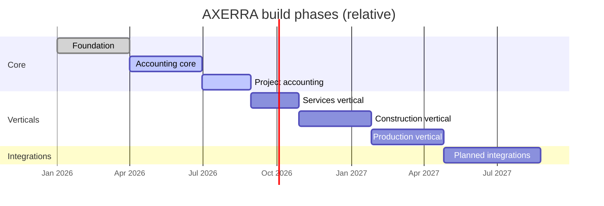

# AXERRA Roadmap

> Greenfield framing. Phases are checked off manually as work completes.
> Source of authority for module taxonomy: PRD §3.0.
> Status as of 2026-05-22.

## Status legend

- `[x]` — implemented in the codebase today
- `[~]` — partial: scaffolding/models present, work remaining (see notes)
- `[ ]` — not yet started

## Timeline

## Phase 1 — Foundation ✅

- [x] Multi-tenant infrastructure (schema-per-tenant, pg-schemata bootstrap) — `apps/server/src/db/` + `moduleRegistry.js`
- [x] Auth + RBAC (4-layer policies, Redis permission cache, login-time role gate) — `apps/server/src/system/auth/` with `Policies`, `PolicyCatalog`, Redis-backed `authRedis`
- [x] Tenant management (admin schema, `portal_users`, `portal_user_tenants`) — `apps/server/src/system/tenants/`
- [x] Core entities (vendors, clients, employees, companies, contacts, addresses) — `apps/server/src/system/core/models/`
- [x] Module entitlement middleware wired into `createRouter` — `apps/server/src/middleware/moduleEntitlement.js` auto-injected (ADR-0018)

## Phase 2 — Accounting core 🟡

- [~] `accounting` module — CoA, journal entries, journal entry lines, posting queues, company accounts present in `apps/server/src/modules/accounting/`. Fiscal periods specified in the PRD (§3.7.2.7), pending implementation.
  - [ ] Posting-queue worker — posting is currently synchronous (`postEntry()` runs inline on `POST /journal-entries/post` and `retry()`). The async drainer the PRD describes (§3.7.4.6), and the `failed`/`error_message` flow, are not yet built.
- [x] AP (invoices, lines, payments, credit memos) — `apps/server/src/modules/ap/models/`
- [~] AR (invoices, lines, receipts) — models present in `apps/server/src/modules/ar/models/`; milestone-invoicing workflow not yet validated end-to-end
- [~] Cross-module posting contract operational (ADR-0019) — schema references exist (`companyTransactionsSchema`); explicit posting hooks from AP/AR into GL not yet wired
- [~] Intercompany accounting — due-to / due-from account pairs modelled and policy-catalog entries seeded; no dedicated controllers / workflows yet

## Phase 3 — Project accounting 🟢

- [x] `projects` module (projects, sub-projects, units) — `apps/server/src/modules/projects/models/` includes `Projects`, `Tasks`, `TaskGroups`, `Units`, `ChangeOrders`, `CostItems`
- [x] `activities` module (cost tracking) — `apps/server/src/modules/activities/models/` includes `Activities`, `Budgets`, `CostLines`, `ActualCosts`. **Note: `Deliverables` and `DeliverableAssignments` still live here pending the §3.0.3 split into the `contracts` vertical module.**
- [x] Cashflow and profitability views — read-only SQL views backed by `profitabilityController`, `cashflowController`, `marginAnalysisController`
- [x] `reports` module (reporting & analytics) — `apps/server/src/modules/reports/controllers/` with profitability, cashflow, margin, cost-breakdown, AR aging, AP aging

**Outstanding for Phase 3 closure:** move deliverables out of `activities` into the planned `contracts` vertical module (§3.0.3).

## Phase 4 — Services vertical ⚪

- [ ] `contracts` (services SOWs and deliverables — receives deliverables migrated out of `activities`)
- [ ] `timesheets`
- [ ] `scheduling`
- [ ] Meridian Group demo tenant exercised end-to-end (PRD §5.1)
- [ ] Intercompany accounting validated under services holding structure

## Phase 5 — Construction vertical ⚪

- [~] `bom` — `apps/server/src/modules/bom/` exists with `CatalogSkus`, `VendorSkus`, `VendorPricing` and 5 controllers. Minimal but real; counts as scaffolded, not complete.
- [ ] `contracts` (construction — subdivision sales, draw schedules, closing statements)
- [ ] `procurement`
- [ ] `inventory`
- [ ] AR closing-statement flow (PRD §3.8.4) posting through ADR-0019
- [ ] Sterling Ridge Homes demo tenant exercised end-to-end (PRD §5.2)

## Phase 6 — Production vertical ⚪

- [ ] `contracts` (production work orders)
- [ ] `scheduling` extensions for production
- [ ] `bom` extensions for production
- [ ] `procurement` extensions for production

## Phase 7 — Planned integrations (customer-gated) ⚪

> None of these are built without a paying customer. See PRD §4.
> No references to Plaid, Avalara, TaxJar, Gusto, or ADP exist in the codebase today.

- [ ] Plaid bank feed → bank reconciliation in `accounting`
- [ ] Sales tax (Avalara / TaxJar)
- [ ] Multi-currency / FX
- [ ] Expense claims
- [ ] HR / payroll (Gusto / ADP)
- [ ] CRM (only if a vertical demands it)
