# AXERRA Architecture

How the pieces fit together: process boot, the Express middleware chain, module
internals, and the data layer. Companion to [CONTRACT.md](./CONTRACT.md), which
states the invariants continuous integration (CI) enforces; this file shows the
shape those invariants protect.

Three things about this architecture are commonly assumed wrong. They are called
out where they appear below, and summarised here:

1. The uniform resource locator (URL) convention is **not** `/api/v1/<module>`.
   The version segment sits inside each module aggregator:
   `/api/<module>/v1/<resource>`.
2. Baseline create/read/update/delete (CRUD) routes are **not** policy-checked.
   `rbac()` is absent from the default chain generated by `createRouter`.
3. The schema-per-tenant switch happens in **two** places, not one, and never
   via `SET search_path`.

---

## 1. System context

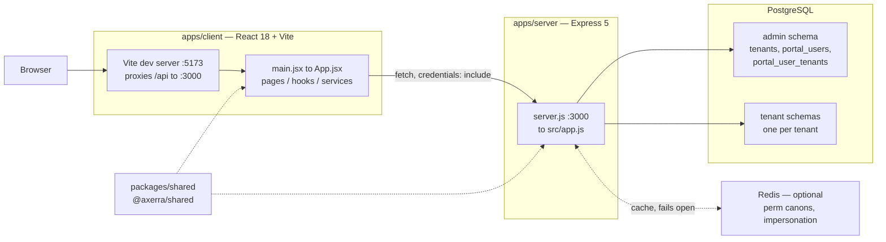

Redis is an **optimisation, not a dependency**. Every Redis path in
[authRedis.js](../../apps/server/src/middleware/authRedis.js) and
[permissionLoader.js](../../apps/server/src/services/permissionLoader.js) is
wrapped in a silent catch that falls through to Postgres. Two things are stored:
permission canons at `perm:<userId>:<tenantCode>` with a 900-second time to live
(TTL), and impersonation state at `imp:<userId>`.

`@axerra/shared` is deliberately tiny — it exports exactly five symbols
(`resolveLevel`, `TAX_TYPES`, `COUNTRIES`, `formatByPattern`, `stripFormatting`)
and is consumed by both apps through npm workspaces resolution (ADR-0011).

---

## 2. Server boot and the middleware chain

[server.js](../../apps/server/server.js) is 23 lines: load `dotenv/config`,
import `src/app.js`, `app.listen(PORT)`. There is no `http.createServer`, no
SIGTERM handler, and no explicit database or Redis initialisation — the database
pool is a side effect of the first `import db.js`, and Redis connects lazily on
first use.

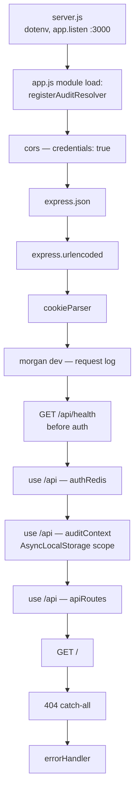

Absent, contrary to expectation: **no `helmet`, no `express-session`, no
rate-limit middleware, and no app-wide `passport`.** None of the first three is
even a declared dependency. `passport-local` is used only inside
`authController.login`, with `{ session: false }`.

Winston is for application logs; `morgan('dev')` is the request logger.

### 2.1 Inside authRedis

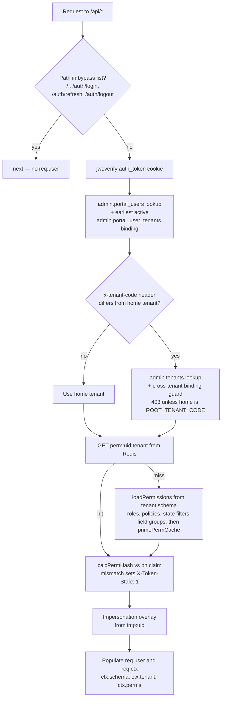

This is the first of the two places the tenant schema is resolved. It writes the
resolved name to `req.user.schema_name` and `req.ctx.schema`.

---

## 3. Route registry and URL shape

[apiRoutes.js](../../apps/server/src/apiRoutes.js) mounts ten module aggregators
under `/api`. The `system/` and `modules/` split is load-bearing — architecture
lint rules (ADR-0022) treat them differently.

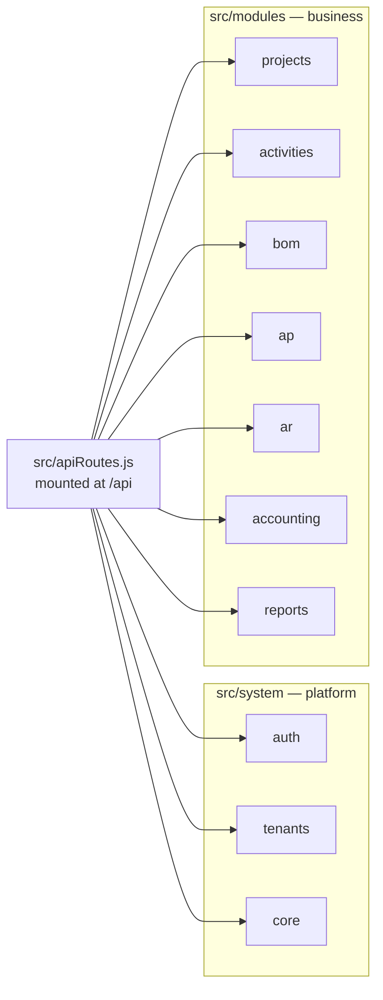

Each aggregator owns its own version segment, so the shape is:

```
/api/<module>/v1/<resource>
```

| Example                        | Module     | Resource     |
| ------------------------------ | ---------- | ------------ |
| `/api/core/v1/vendors`         | core       | vendors      |
| `/api/ar/v1/ar-invoices`       | ar         | ar-invoices  |
| `/api/tenants/v1/portal-users` | tenants    | portal-users |
| `/api/auth/login`              | auth       | — (flat)     |

`/api/auth/*` is the one exception: `authRouter` mounts flat, with no `v1`
segment.

---

## 4. Module anatomy

Every module follows the same layout. Accounts receivable (`ar`) is the worked
example below because it exercises the full set.

```
src/modules/ar/
  apiRoutes/v1/  arApiRoutes.js  arInvoicesRouter.js  ...
  controllers/   arInvoicesController.js
  models/        ArInvoices.js
  schemas/       arInvoicesSchema.js
  schema/migrations/
  arRepositories.js
```

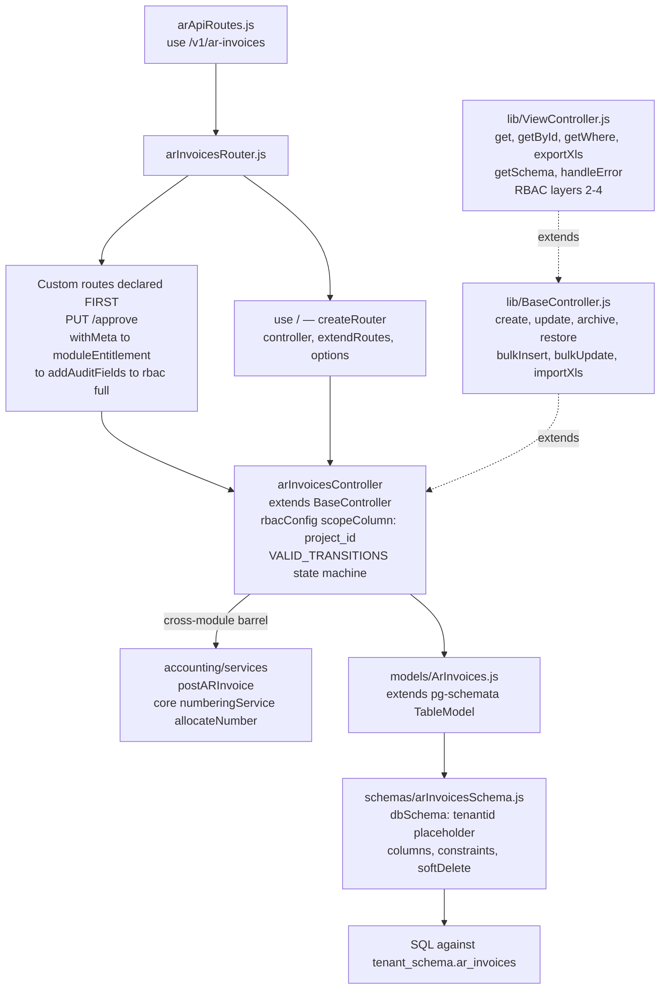

There is **no validator or data transfer object (DTO) layer.** Validation is the
pg-schemata schema definition, plus ad-hoc controller checks such as
`VALID_TRANSITIONS` and `SCHEMA_NAME_RE`. `zod` is a declared dependency with
zero imports in `src/`.

`services/` appears only where logic spans entities — `numberingService` in
`core`, the posting barrel in `accounting` (ADR-0019). The `reports` module
skips models entirely and issues raw `SELECT * FROM <schema>.vw_*` against SQL
views (ADR-0020).

### 4.1 What createRouter generates

[createRouter.js](../../apps/server/src/lib/createRouter.js) is the route
factory behind nearly every resource. It generates 13 routes, each with
`disable*` opt-outs:

| Method | Path            | Controller method |
| ------ | --------------- | ----------------- |
| POST   | `/`             | `create`          |
| GET    | `/`             | `get`             |
| GET    | `/where`        | `getWhere`        |
| GET    | `/archived`     | `getWhere`        |
| GET    | `/ping`         | — (inline `pong`) |
| GET    | `/:id`          | `getById`         |
| POST   | `/bulk-insert`  | `bulkInsert`      |
| POST   | `/import-xls`   | `importXls`       |
| POST   | `/export-xls`   | `exportXls`       |
| PUT    | `/bulk-update`  | `bulkUpdate`      |
| PUT    | `/update`       | `update`          |
| DELETE | `/archive`      | `archive`         |
| PATCH  | `/restore`      | `restore`         |

Chain assembly, per method:

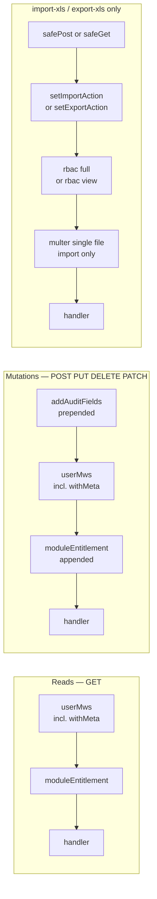

`rbac()` is **not** in the default CRUD chain. Across the 68 entity routers, 13
reference `rbac(` at all: every router under `system/tenants/`, plus
`vendorsRouter`, `clientsRouter`, `employeesRouter`, `vendorContactsRouter`,
`arInvoicesRouter` (approve), `journalEntriesRouter`, `budgetsRouter`, and
`postingQueuesRouter`. Everywhere else — all of `projects`, `ap`, `bom`,
`reports`, and most of `core` and `accounting` — baseline CRUD is authenticated
and module-entitled, with layer-1 policy gating only on `/import-xls` and
`/export-xls`. Layers 2 through 4 still filter rows and columns, but only for
controllers that set `this.rbacConfig`.

`/ping` intentionally carries no middleware. Routers that must not leak their
existence pass `disablePing: true`.

---

## 5. Request trace

`GET /api/ar/v1/ar-invoices?project_id=…` with `Cookie: auth_token=…` and
`x-tenant-code: SRH`.

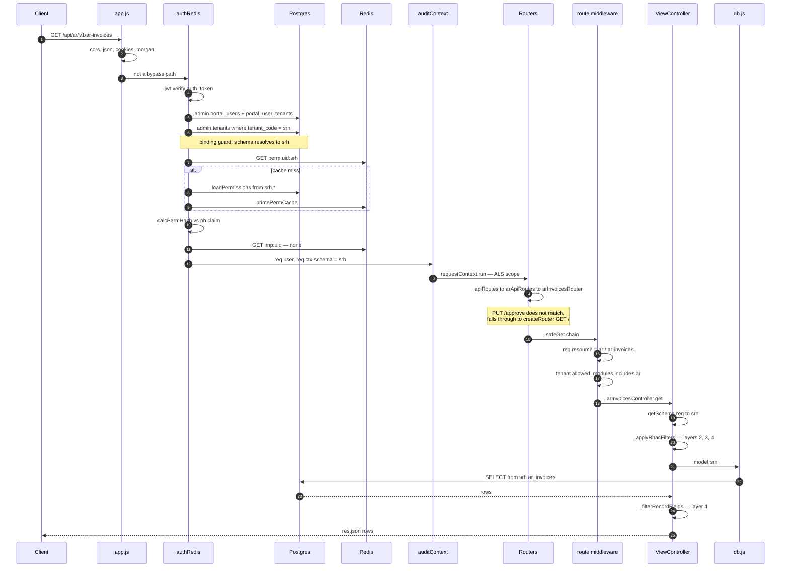

On throw, `ViewController.handleError` maps the Postgres error code and usually
terminates the request itself — `23505` to 409, `23503` to 400, `22001` to 400.
The global [errorHandler](../../apps/server/src/middleware/errorHandler.js)
therefore fires rarely; when it does, it maps `SchemaDefinitionError` to 400,
`23505` to 409, `23503` to 422, passes through `err.status`, and otherwise
returns 500 with the message hidden in production.

The `auditContext` AsyncLocalStorage scope is what lets pg-schemata stamp
`created_by` / `updated_by` without any controller threading the actor through
explicitly. `addAuditFields`, despite its name, no longer sets those columns; it
guards mutation routes and injects `tenant_code` / `tenant_id` on POST.

---

## 6. Data layer

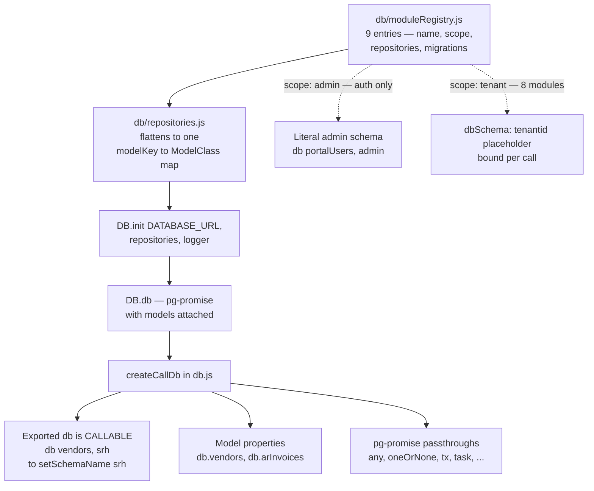

Only `auth` is `scope: 'admin'`. `core` and all seven business modules are
`scope: 'tenant'`.

### 6.1 Where the schema switch happens

Two places, and nothing uses `SET search_path`:

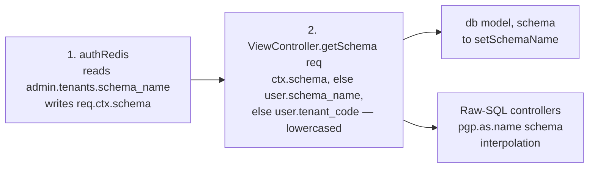

Every controller call re-reads the schema and rebinds the model. Reports and
other raw-SQL paths interpolate the schema name through `pgp.as.name` instead.

### 6.2 Tenant provisioning

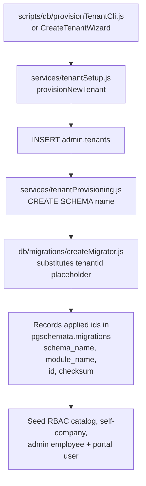

Schema arrives through pg-schemata `createTable` at tenant bootstrap — there are
no standalone data-definition-language (DDL) or backfill migration files.

---

## 7. Role-based access control

Four layers (ADR-0013, superseding ADR-0004). They execute in two different
places, and only the first is middleware.

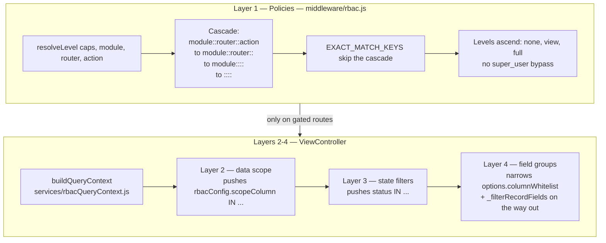

Layer 1 gates only the routes that explicitly mount `rbac()` — see §4.1. Layers
2 through 4 run inside `ViewController` for any controller that sets
`this.rbacConfig`, independent of whether layer 1 ran.

Permission canons are assembled by
[permissionLoader.js](../../apps/server/src/services/permissionLoader.js) from
the tenant schema and cached in Redis for 900 seconds.
[permCacheInvalidator.js](../../apps/server/src/services/permCacheInvalidator.js)
evicts on role and policy change, fire-and-forget, with the TTL as the backstop.

---

## Client side, briefly

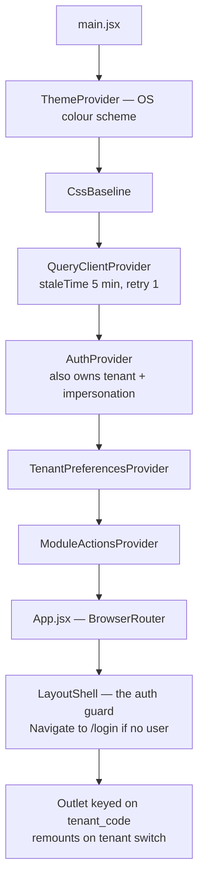

Data access is three hand-written layers, no axios and no code generation:

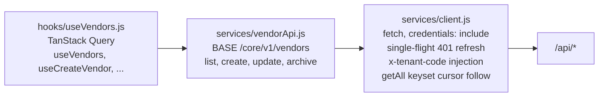

`BrowserRouter` lives in `App.jsx`, not `main.jsx`, so the router is inside
every provider. There is no `ProtectedRoute` component — `LayoutShell` is the
guard.
Route-level capability enforcement is absent by design: the sidebar filters
navigation by `user.perms.caps`, and the server is the actual gate.
